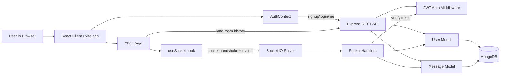

# Chat App Architecture

## Overview

This project is a full-stack real-time chat application with:

- A React + Vite frontend
- An Express + Socket.IO backend
- MongoDB for persistence
- JWT-based authentication for both HTTP and socket connections

REST APIs are used for authentication and loading chat history. Socket.IO is used for real-time messaging, typing updates, room presence, and online user state.

## Architecture Diagram



If your Mermaid tool expects raw Mermaid text instead of Markdown, paste only this part without the triple backticks:

```text
flowchart LR
    U["User in Browser"]
    C["React Client / Vite app"]
    A["AuthContext"]
    CH["Chat Page"]
    S["useSocket hook"]
    API["Express REST API"]
    WS["Socket.IO Server"]
    AUTH["JWT Auth Middleware"]
    SH["Socket Handlers"]
    DB[("MongoDB")]
    UM["User Model"]
    MM["Message Model"]

    U --> C
    C --> A
    C --> CH
    CH --> S

    A -->|"signup/login/me"| API
    CH -->|"load room history"| API
    S -->|"socket handshake + events"| WS

    API --> AUTH
    API --> UM
    API --> MM
    WS --> SH
    SH -->|"verify token"| AUTH
    SH --> UM
    SH --> MM

    UM --> DB
    MM --> DB
```

## Request Flow

### 1. Signup or login

1. The user opens the React app.
2. `AuthContext` sends `POST /api/auth/signup` or `POST /api/auth/login`.
3. The Express auth route validates credentials.
4. The server creates or verifies the user in MongoDB.
5. The server returns a JWT token and user info.
6. The client stores the token in `localStorage`.

### 2. Session restore

1. On app startup, `AuthContext` checks for `chat-token` in `localStorage`.
2. If present, it calls `GET /api/auth/me`.
3. The `protect` middleware verifies the JWT.
4. If valid, the user session is restored in React state.

### 3. Loading room history

1. The user enters the chat page.
2. `Chat.jsx` fetches `GET /api/messages/:room`.
3. The backend validates the token.
4. The server queries MongoDB for room messages.
5. The messages are returned and rendered in the room.

## Real-Time Socket Flow

### 1. Socket connection

1. After login, the client creates a Socket.IO connection using the JWT token.
2. The socket middleware verifies the token before the connection is accepted.
3. The server loads the user from MongoDB and attaches user info to `socket.user`.
4. The user is placed into the default `general` room.
5. The server broadcasts the current online user list.

### 2. Join room

1. When the active room changes, the client emits `join-room`.
2. The server removes the socket from the old room.
3. The server normalizes and joins the new room.
4. The in-memory online user map is updated.
5. The online user list is broadcast again.

### 3. Send message

1. The user submits the message form.
2. The client emits `send-message` with `room` and `content`.
3. The server validates the payload.
4. The server saves the message in MongoDB.
5. The server emits `new-message` to everyone in that room.
6. Each connected client appends the new message to local room state.

### 4. Typing indicator

1. While typing, the client emits `typing`.
2. The server forwards `user-typing` to other users in that room.
3. The client shows a temporary typing indicator.

### 5. Disconnect

1. When a socket disconnects, the server removes it from the online user map.
2. The server broadcasts the updated online user list.

## Where Socket.IO Fits

Socket.IO is the live event layer between the chat UI and the backend.

It is not replacing REST. Instead:

- REST handles request/response tasks:
  - login
  - signup
  - token verification
  - loading older messages
- Socket.IO handles low-latency shared events:
  - new messages
  - typing indicators
  - room switching
  - online user presence

In short:

- MongoDB is the source of truth for saved users and messages.
- Express APIs are the secure entry point for normal data fetching.
- Socket.IO is the instant delivery channel for collaborative behavior.
- The React client combines both to feel like a real-time chat product.
